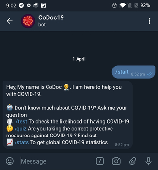
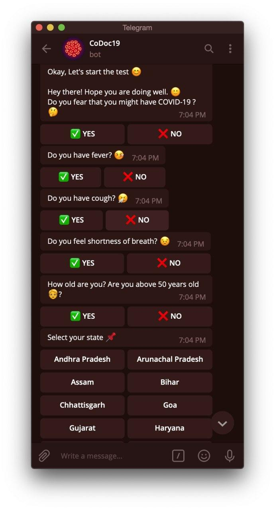
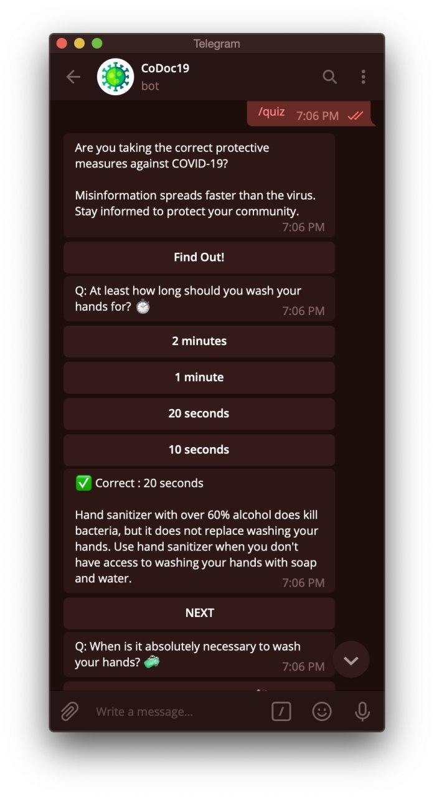
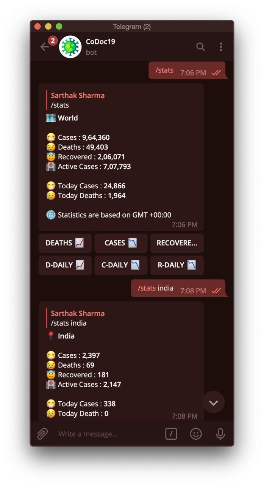
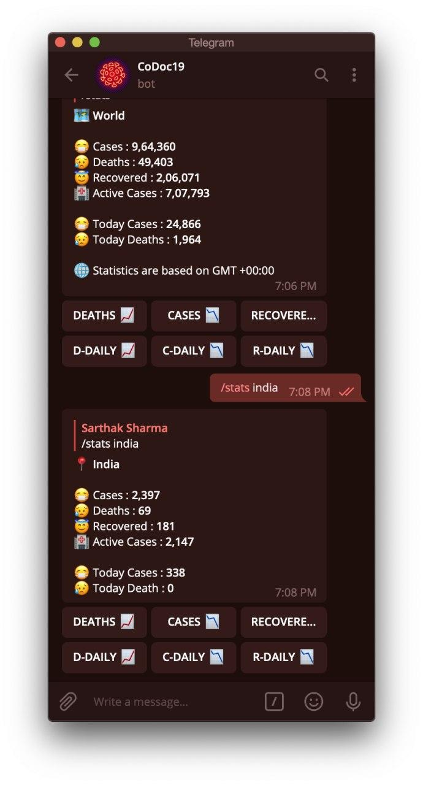

# CoDoc19 :robot:

CoDoc19 is a telegram bot which helps to let you know more about COVID-19. 



## Install

The telegram handler is [@CoDoc19Bot](https://t.me/CoDoc19Bot). So just go to telegram app and start interacting with it :man_technologist:

## Features / Commands

To start interacting with the bot :beginner:
```
/start
```
After entering this command you will get the available commands

### Corona Test

To check the likelihood of having COVID 19 :clipboard:

```
/test
```



With this test you can quickly check the likelihood of having Covid-19. This test is regularly updated and based on the recommendations of certified health organizations. It is purely intended to provide guidance and is not an official diagnosis.

### Quiz

To check if you're taking the correct protective measures against COVID-19.

```
/quiz
```



Several questions with options. You have to choose the right answer to ensure you have been good in taking measures :fist_left:

4. To get current statistics of death, cases, recoveries etc. :chart_with_upwards_trend:

### Statistics

```
/stats
```

To get statistics related to death, active cases and recovered cases. Both global level and country wise.

#### Global

To get global statistics, you just have to pass the `/stats` command



#### Country-wise
To get country-wise statistics, you can directly pass **country name** or **country code**.




## TODO

- [ ] Build web interface 
- [ ] Build facebook bot


## Contributing

1. 🍴 Fork this repo!
2. **HACK AWAY!** 🔨🔨🔨
3. 🔃 Create a new pull request.

Feel free to contribute to this project and treat it like your own. 😊

## Contributors

- [theapache64 🚁](https://github.com/theapache64)
- [pavanjadhaw 🍀](https://github.com/pavanjadhaw)
- [shishirjha :cyclone:](https://github.com/shishirjha)


## License

[Apache 2.0](https://github.com/teamxenox/codoc19/blob/master/LICENSE)
